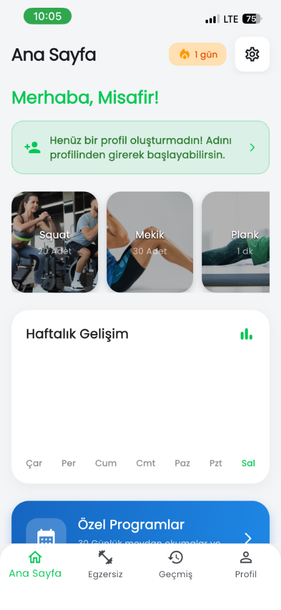
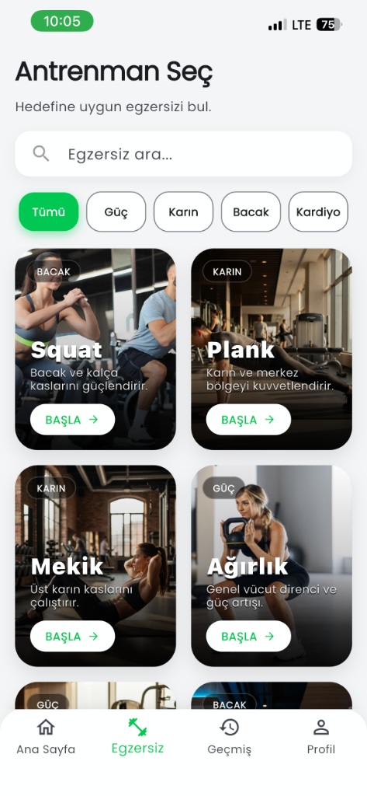
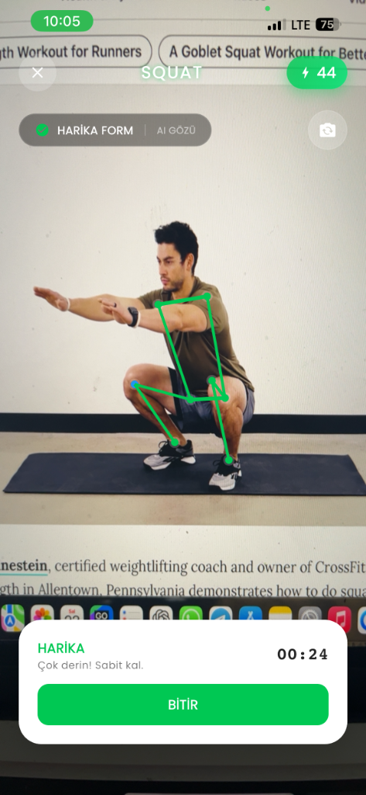
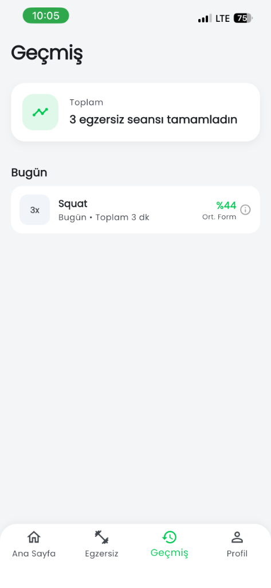
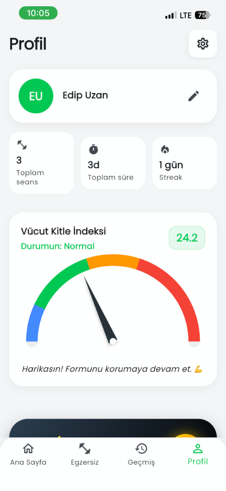

# Posturify


---

## � English

**Posturify** transforms your smartphone into an elite personal trainer. Leveraging cutting-edge computer vision, it audits your workout form in real-time, delivering instant corrective feedback to ensure every rep counts.

### 💎 Why Posturify?

*   **🛡️ Injury Shield:** Bad form is the silent killer of progress. Posturify acts as your digital guardian, catching misalignments milliseconds before they become potential injuries.
*   **⚡ Zero Wasted Effort:** Quality beats quantity. Our smart engine ignores sloppy reps, forcing you to maintain perfect technique for every single count.
*   **🎒 Gym in Your Pocket:** Ditch the bulky equipment. Whether you're in a hotel room or a garage, your phone is now a world-class biomechanics lab.

### 📸 Visual Tour

| **Hub** | **Arsenal** | **Action** |
|:---:|:---:|:---:|
|  |  |  |
| *Your Command Center* | *Select Your Challenge* | *Real-time Corrections* |

| **Evolution** | **Identity** |
|:---:|:---:|
|  |  |
| *Track Your Growth* | *Level Up Your Avatar* |

### 🔥 Core Capabilities

*   **👁️‍🗨️ Biometric Vision:** Tracks 33 anatomical landmarks at 30 frames per second using Google ML Kit.
*   **🎧 Sonic Feedback:** No need to look at the screen. The app speaks to you: "Lower your hips," "Straighten your back."
*   **🎯 Precision Counting:** Only valid reps trigger the counter. Cheating is impossible.
*   **⚔️ Gamified Grind:** Earn XP, shatter records, and unlock prestigious badges as you improve.
*   **🔒 Ironclad Privacy:** 100% on-device processing. Your video feed never leaves your phone.

### 🧪 Under the Hood

*   **Engine:** Flutter & Dart
*   **Brain:** `google_mlkit_pose_detection`
*   **Vault:** `hive` (Ultra-fast local NoSQL)
*   **Flow:** `auto_route`

### 🔌 Quick Start

1.  **Clone:**
    ```bash
    git clone https://github.com/edpuzn/Posturify.git
    cd Posturify
    ```

2.  **Hydrate:**
    ```bash
    flutter pub get
    ```

3.  **Ignite:**
    ```bash
    flutter run --release
    ```

---

## 🇹🇷 Türkçe

**Posturify**, akıllı telefonunuzu elit bir kişisel antrenöre dönüştürür. Gelişmiş bilgisayarlı görü teknolojisi ile egzersiz formunuzu saniye saniye denetler ve her tekrarın mükemmel olması için size anlık sesli komutlar verir.

### 💎 Neden Posturify?

*   **🛡️ Sakatlık Kalkanı:** Yanlış form, gelişimi durdurur ve sakatlığa yol açar. Posturify, duruşunuz bozulduğu an devreye girer ve sizi korur.
*   **⚡ Sıfır Kayıp:** Nicelik değil, nitelik önemlidir. Akıllı motorumuz, baştan savma hareketleri görmezden gelir; sizi her tekrarda mükemmelliğe zorlar.
*   **🎒 Cepteki Spor Salonu:** Pahalı ekipmanlara gerek yok. Odanızda, parkta veya ofiste; telefonunuz artık profesyonel bir biyomekanik laboratuvarı.

### 🔥 Temel Yetenekler

*   **👁️‍🗨️ Biyometrik Görüş:** Vücudunuzdaki 33 kritik noktayı Google ML Kit ile saniyede 30 kez tarar.
*   **🎧 Sesli Koç:** Ekrana bakmanıza gerek yok. Uygulama sizinle konuşur: "Kalçanı düşür", "Sırtını dik tut".
*   **🎯 Hassas Sayaç:** Hile yapmak imkansız. Sadece nizami formda yapılan hareketler skora işlenir.
*   **⚔️ Oyunlaştırma:** Antrenman yaptıkça XP kazanın, rekorları kırın ve rütbenizi yükseltin.
*   **🔒 Tam Gizlilik:** Tüm işlemler cihazınızda (on-device) yapılır. Görüntünüz asla internete yüklenmez.

### 🧪 Teknik Altyapı

*   **Motor:** Flutter & Dart
*   **Beyin:** Google ML Kit
*   **Kasa:** Hive (Yerel Veritabanı)
*   **Akış:** Auto Route

### 🔌 Kurulum

1.  **İndir:**
    ```bash
    git clone https://github.com/edpuzn/Posturify.git
    cd Posturify
    ```

2.  **Hazırla:**
    ```bash
    flutter pub get
    ```

3.  **Ateşle:**
    ```bash
    flutter run --release
    ```
